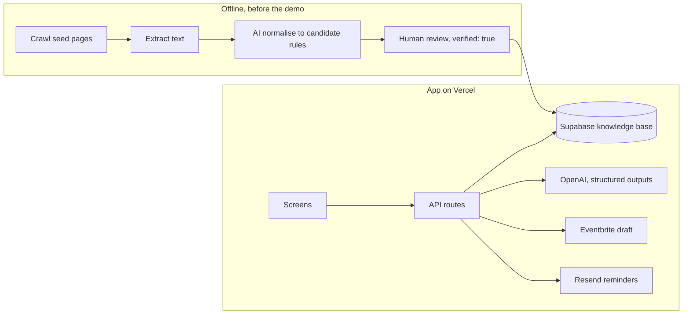

# HostReady

**Describe your event once, and HostReady produces your council permit paperwork, safety plan, site plan and liquor licence application, ready to lodge.**

New Zealand event organisers, mostly volunteers, face long, inconsistent, deadline-driven council paperwork. HostReady reads a plain-English event description, works out exactly which documents the council needs and why (deterministic rules with a source for every one), drafts them to the council's own templates, checks each draft against the council checklist, counts every deadline in working days, emails reminders, exports one PDF pack, and hands the approved event to Eventbrite as a draft.

Built at Saasthon 2026 (University of Canterbury) for Christchurch City Council, the only council it supports.

## Quick start

```bash
npm install
cp .env.example .env.local      # MOCK=1 is the default: no keys, no login, fixture data
npm run dev                     # http://localhost:3000/new
npm test && npm run typecheck
```

With `MOCK=1`, every API route returns `fixtures/demo-event.json` in the exact shape of the real response, so the UI, backend, AI and knowledge base can all be built at the same time. Setting up Supabase, Vercel and the keys is covered in [docs/SETUP.md](docs/SETUP.md).

## How it works



| Step | Who | Where |
| --- | --- | --- |
| 1. Event profile from the description | AI, every field tagged stated / inferred / answered | `lib/ai/profile.ts` |
| 2. Up to 3 follow-up questions, only for fields a rule depends on | Rules pick, fixed wording | `lib/ai/profile.ts` |
| 3. Likely community or commercial classification | AI over retrieved council text | `lib/ai/classify.ts` |
| 4. Required documents, each with a reason and source | Rules, no AI | `lib/rules` |
| 5. Draft each document to the council template | AI plus retrieval | `lib/ai/draft.ts` |
| 6. Check against the council checklist, one-click fix | AI | `lib/ai/check.ts` |
| 7. Deadlines in working days, incl. the 20 Dec to 15 Jan liquor period | Rules, no AI | `lib/deadlines` |
| 8. PDF pack, reminders, Eventbrite draft (locked until all green) | Code | `lib/pdf`, `lib/integrations` |

## Repo map

```
app/(screens)/      six screens: new, events/[id]/{profile,documents,site-plan,deadlines}, dashboard   (lane D)
app/api/            every route, mock-first                                                              (lane C)
lib/schemas.ts      THE contract: Zod schemas for every AI output and API response                        (lane A)
lib/api/client.ts   typed browser client; screens call only this
lib/api/server.ts   route helpers: auth (requireOrg), org-scoped loaders, errors as JSON
lib/ai/             OpenAI calls, prompts, retrieval, DEMO_MODE fallback                                  (lane A)
lib/rules/          deterministic rules engine + hand-verified CCC rules                                  (B rules, C engine)
lib/deadlines/      working days, Canterbury holidays, liquor holiday period                              (lane C)
lib/integrations/   Eventbrite (draft only), Resend                                                       (lane C)
lib/pdf/            PDF pack                                                                              (lane C)
lib/supabase/       admin (service role), server (session), browser (sign-in only)                        (lane C)
scripts/ingest/     crawl → extract → load → normalise → publish                                          (lane B)
supabase/migrations schema, pgvector search, RLS                                                          (lane C)
fixtures/           the demo event, a full mocked run                                                      (lane A)
tests/              rules, deadlines, NZ time, fixture contract
docs/               PRD, TRD, setup, lane briefs
```

## Team

| Lane | Owner | Brief |
| --- | --- | --- |
| A, AI and pitch (lead) | Ashu | [docs/lanes/A-ai.md](docs/lanes/A-ai.md) |
| B, Knowledge base | B | [docs/lanes/B-knowledge.md](docs/lanes/B-knowledge.md) |
| C, Backend and integrations | C | [docs/lanes/C-backend.md](docs/lanes/C-backend.md) |
| D, Frontend and deploy | D | [docs/lanes/D-frontend.md](docs/lanes/D-frontend.md) |

Coding agents: [AGENTS.md](AGENTS.md) is loaded automatically by Codex and (through CLAUDE.md) by Claude Code.

## Status and known gaps

- Tested: rules engine, answer merging, deadline engine, NZ timezone conversion including the day daylight saving starts, and fixture/schema contract (35 tests). Every route smoke-tested in MOCK mode, PDF export included.
- Not yet run against live services: Supabase, OpenAI, Eventbrite, Resend. The code paths typecheck. Each lane brief has the gate that proves its part live.
- Host responsibility and alcohol management plan rules, Canterbury holiday dates: see the TODOs in the lane briefs.

HostReady prepares documents. The organiser reviews them and lodges them with the council. This is not legal advice.
