# EvntX PRD

26 Sep 2026, updated 29 Sep 2026 to match the app as built · Ashutosh Gauniyal · Markdown copy of the PRD for the team and coding agents. The functional requirements table says what is built, built differently, or not built. Technical detail is in docs/TRD.md.

## Summary and problem

EvntX turns a plain-English event description into a council-ready permit and liquor licence pack, checked against council rules, with every deadline tracked. The weekend MVP covers Christchurch City Council (CCC) and one complete flow, from blank page to exported pack and an Eventbrite draft. CCC is the only council; council rules are stored as data, so more can be added later.

**One-line pitch.** Describe your event once, and EvntX produces your council permit paperwork, safety plan, site plan and liquor licence application, ready to lodge.

**Positioning.** TurboTax for event permits today. Every public event has to be approved before it can happen, so owning that step lets EvntX become the platform events are run on, the Shopify for events.

**The problem.** Anyone running a public event in NZ faces council paperwork that is long, inconsistent between councils and deadline driven. Organisers, usually volunteers, find out about requirements and costs too late, cannot tell how the council will classify their event, and retype the same details into several forms. Today they use blank council templates, pay a consultant, or give up on parts of the event.

A CCC event permit is required if the event is on a public park or road, open to the public, with over 150 people expected, or if it has infrastructure such as marquees, stages or bouncy castles, vehicle access, food sold or served, road or footpath restrictions, amplified sound, or amusement devices ([CCC event permits](https://ccc.govt.nz/news-and-events/events/running-an-event/event-permits)). A typical club fundraiser triggers most of these at once, plus a special liquor licence.

## Evidence

Only verified sources go on pitch slides.

| Case | What happened | What EvntX would have done | Source |
| --- | --- | --- | --- |
| Ashburton Santa parade and market | Council classified the 2025 market as commercial and required a $2050 permit while the parade fee was waived. Road closure is the parade's biggest cost at about $3500 | Flag the likely classification and fee before applying, suggest how to present it as community | 1News, Jul 2026 |
| Featherston Anzac Day parade | Council would not close SH2 because it could not afford traffic management, so the march became stationary. Prior TMP estimate was $7186 plus GST | Surface road closure costs at intake, flag long-lead items early | Times-Age, SWDC report |
| National Events Strategy | Government announced a new strategy on 22 Sep 2026, with guidance for local government and better information sharing to follow | Why now: government has admitted the problem, we do the work today | MBIE |
| Independent events review (MartinJenkins) | Public events are most affected by consenting, public-space use and compliance; more consistent local settings would reduce avoidable friction | Headline problem statement | Review summary |

**Unverified, not for slides yet:** Mount Eden Anzac parade ($7k to $13k TMP), Motueka parade quotes, Petone marshal shortage, Gisborne $91 pre-approved TMPs, the Hospitality Regulatory Review duplication finding, the lead-time spread between councils.

**Customer validation.** Saturday calls to 5 to 10 local clubs, bars and market organisers, same four questions: (1) how long did your last event or licence paperwork take, (2) what got sent back or delayed, (3) who does it, volunteer or staff, (4) would you pay $29 to have it done in 10 minutes. Two best quotes go on a slide.

## Goals, non-goals and success metrics

**Weekend goal.** A judge watches one volunteer go from a blank page to a council-ready pack in under three minutes, live, on the deployed URL.

Product goals:
1. Tell organisers exactly which documents their event needs and why, before they start.
2. Draft those documents specific to the event, following council templates.
3. Catch gaps against the council checklist before lodging.
4. Make sure no deadline is missed, including licence renewals months or years later.
5. Hand the approved event on to ticketing (Eventbrite) without retyping.

**Non-goals for the weekend.** Councils other than CCC, real lodgement, payments, team roles, a mobile app, full traffic management plans (flagged only), our own ticketing, promo content, sales analytics.

| Metric | Target | Why |
| --- | --- | --- |
| Description to exported pack | Under 10 min for a new user, under 3 in the demo | Core value claim |
| Follow-up questions asked | 3 or fewer | Proves the AI understood |
| Checklist items passing on first draft | 80% or more | Draft quality |
| Packs returned by council for missing info | Lower than users' previous events | Real outcome, post-launch |
| Events per club per year | 3 or more | Retention |
| Venue plan renewal rate | 90%+ annually | Revenue quality |

## Personas

We design for the volunteer and sell to the organisation.

| Persona | Who | Job to be done | Pays |
| --- | --- | --- | --- |
| Club volunteer (primary user) | Sports club, school or community group volunteer, 2 to 6 events a year | Get the fundraiser approved without learning council rules | Club plan, $49/month |
| Mike, venue manager | Bar, restaurant or brewery with a premises licence | Never miss a renewal or certificate expiry, run special events easily | Venue plan, $79/month |
| Priya, event company | Festival or market organiser, 10+ events a year | Produce packs fast and consistently across sites | Higher tier, roadmap |
| One-off organiser | Anyone running a single public event | Get it right once | $29 per event |
| Committee approver | Club president or licensee | Sign off documents before lodging | Included |

**Demo scenario: Hagley Summer Sounds.** Jordan, a volunteer organiser, is running an all-ages music festival at Hagley Park on Sun 14 Mar 2027 for about 500 people: a bar selling beer and wine, four food trucks, a kids zone with a bouncy castle, a main stage and marquees. It triggers eight CCC requirements at once, so the pack is rich. The current placeholder lives only in `fixtures/demo-event.json`; nothing else depends on it (see AGENTS.md "Demo scenario").

## User journey

One description flows through every step. The organiser types once and reviews, never retypes.

```mermaid
flowchart LR
  A[Describe event, attach photos or PDFs] --> B[AI event profile and classification]
  B --> C[Up to 3 questions, who's doing what]
  C --> D[Rules pick required documents]
  D --> E[AI drafts and checks each document]
  E --> F[Fix red items, read and tick each draft]
  F --> G[Site plan picture]
  G --> H[Lodge dates, costs, reminders, PDF pack]
  H --> I[Eventbrite draft]
```

Eventbrite unlocks only once every checklist item is green and the organiser has read and ticked every draft, so tickets are never sold for an event without its paperwork in order. After the event, Home keeps licences and past events ready for next time.

The app has four steps (Details, Documents, Site plan, Deadlines, shown as "Step n of 4"), with Home, Budget and Licences in the sidebar.

| Screen | What the user sees | Demo moment |
| --- | --- | --- |
| Describe (`/new`, also the box on Home and the landing page) | One text box (10 to 2,000 characters), voice input where the browser supports it, attach up to 8 photos or PDFs, "start from a past event" chips | The organiser types one paragraph |
| 1 Details | Likely community or commercial call with the reasoning, key facts grid, venue map, "Edit details", "See what you typed" with highlighted phrases | AI understanding becomes facts |
| Questions (part of Details) | Up to 3 tap questions, each with why it matters, then "Who's doing what": organiser, contact, duty manager, security, food and waste, named once and reused in every document | Only questions that change the pack |
| 2 Documents | Pack list with status and the reason and source for each. Each draft: council checklist, red items with suggested fixes to pick or write your own, edit the wording, view or download the PDF (the council's own form for the special licence and hazard register), and an "I've read this draft" tick. The event permit shows CCC's online form filled in, with copy buttons | Red turns green |
| 3 Site plan | The organiser's own site plan picture, uploaded or attached at the start, with a suggestion drawn on it ("Suggested spot") | Visual, tangible |
| 4 When to lodge | Month calendar with recommended and legal minimum lodge dates and the 20 Dec to 15 Jan liquor break, licence costs from the council's fee schedules, PDF pack, reminder switch, Eventbrite draft | Reminder email lands live |
| Home | Upcoming events with their pack status, licences expiring soon, past events | Why they come back |
| Licences | Licences and certificates by expiry, "renew soon" under 90 days | Venue retention |
| Budget | The organiser's own cost lines and total, kept in this browser | |

Mockups: the "EvntX app screens" link in the original PRD (ask Ashu).

## Functional requirements

P0 must work end to end in the live demo. P1 only after P0 is stable on the deployed URL. P2 is a roadmap slide.

| ID | Requirement | Acceptance criteria | Priority | Status |
| --- | --- | --- | --- | --- |
| F1 | Login and saved events | Email magic link via Supabase plus guest sign-in, events persist per organisation (one organisation per user) | P0 | Built |
| F2 | Event description intake | Free text 10 to 2,000 characters, submits in one click. Voice input and up to 8 photo or PDF attachments | P0 | Built |
| F3 | AI event profile | All profile fields as structured JSON, each tagged stated, inferred or answered, unknowns in a missing list. Organiser can edit any field | P0 | Built |
| F4 | Follow-up questions | Only for missing fields that change requirements, max 3, tap answers. Then "who's doing what": each role named once, filled into every document | P0 | Built |
| F5 | Required documents rules | Deterministic rules map the profile to documents, each with a plain-English reason, from CCC permit triggers | P0 | Built |
| F6 | Document drafting | Drafts special licence application, host responsibility policy, event safety plan, hazard register and the other drafted types, specific to the event, following CCC templates. Organiser can edit the wording and must read and tick each draft | P0 | Built |
| F7 | Council checklist check | Each draft checked item by item, green or red. Red items offer suggested fixes the organiser picks, changes or writes, then the draft is re-checked | P0 | Built differently: the organiser chooses the fix, it is never applied blind |
| F8 | Deadline timeline | Working days, excludes 20 Dec to 15 Jan liquor period, shows legal minimum and recommended date on a month calendar | P0 | Built |
| F9 | PDF export | One PDF with every document, plus the filled council forms. Each document also downloads on its own | P0 | Built |
| F10 | Site plan | The organiser's own site plan picture with a suggestion marked on it | P1 | Built differently: picture upload, not a drawn plan. The suggestion is a fixed demo review; live AI review of the picture is not built. A draggable plan with site checks exists in code but is not on screen. **Planned:** live AI review of the uploaded picture, and a draggable plan (licensed area, exits, first aid, assembly point) with live site checks, alongside the picture |
| F11 | Reminder emails | Cron sends reminders 14 and 3 days before each deadline, one triggerable live in the demo | P1 | Built. Emails go only to the configured address; the on-screen switch is not saved |
| F12 | Eventbrite draft | Locked until all checks are green and every draft is ticked, creates a draft with ticket classes, NZD, Pacific/Auckland, returns the link. Never publishes | P1 | Built |
| F13 | Rule sources | Each requirement, checklist and deadline links to its council source with a last-checked date | P1 | Built |
| F14 | Classification and fee estimate | AI flags likely community or commercial with reasoning. Licence costs come from the council's published fee schedules with sources; unknown fees say "varies, check with council" | P1 | Built |
| F15 | Home and licences | Upcoming and past events, licence and certificate expiry (seeded data), start a new event from a past one's description | P1 | Built. "Run it again" copies the description only; licences can't be added in the app yet. **Planned:** add, edit and remove licences and certificates in the app |
| F16 | Fill official council forms | Special licence on CCC form CON4414, hazard register on CCC's Safety Risk Assessment Form, event permit as CCC's online form opened pre-filled | P2 | Built |
| F17 | Committee sign-off link | Approver reviews and approves each document, logged | P2 | Not built (organiser ticks their own drafts; Share copies the link) |
| F18 | Council email response | Paste a council request, AI updates documents and drafts the reply | P2 | Not built |
| F19 | Stallholder applications | Vendors upload certificates once, organiser sees compliance | P2 | Not built |
| F20 | Budget | Organiser's own cost lines and total | Extra | Built, stored in the browser only. **Planned:** saved per event on the server, shared with the organisation, council fees filled in from the fee schedules |

## AI design

AI handles understanding and writing. Deterministic rules handle decisions that must be right every time.

| Step | Who | How | Guardrail |
| --- | --- | --- | --- |
| Event profile | AI | Structured outputs against a Zod schema, source tag per field | Unknowns go to a missing list, never guessed |
| Follow-ups | Rules pick, fixed wording | Only missing fields that change requirements | Max 3 |
| Classification | AI | Reasons over profile plus council definitions | Shown as "likely", with reasoning |
| Required documents | Rules | Coded CCC triggers and licence rules | Every document has a reason and source |
| Drafting | AI | Council template and checklist sent with each request, then a second pass that removes facts nobody gave | Placeholders for unknowns, never invented; names come from "who's doing what" |
| Checklist check | AI plus rules | Each item evaluated against the draft, pass/fail with evidence quoted from the draft | Organiser picks the fix and ticks each draft before lodging |
| Deadlines | Rules | Working-day calculator with holiday periods | No AI in date maths |

**Why not just ChatGPT or Claude with a skills file?** A chat can write a safety plan if you already know you need one, know the current council rules and remember the deadline. Our users know none of that. EvntX knows which documents this event needs, checks them against rules we keep current with sources and dates, remembers the event and sends reminders months or years later, and lets several people work on the same event. A chat forgets you when the tab closes. TurboTax exists even though anyone can ask a chatbot about their taxes. Make this visible on screen: the source link and "checked 26 Sep 2026" on every requirement, the reminder email landing live, and the Eventbrite lock.

**Demo data.** One seeded demo event (fixtures/demo-event.json) with a cached successful run as a fallback if the API is slow on stage.

## Non-functional requirements

| Area | Requirement |
| --- | --- |
| Accuracy | Rules and fees shown only with a source and last-checked date. Unknown fees say "varies, check with council" |
| Legal position | EvntX prepares, the organiser reviews and lodges. Not legal advice, stated in the footer and export |
| Privacy | Only event and organisation details stored. Demo uses fake people and events. RLS per organisation |
| Performance | Profile under 10 s, all drafts under 60 s, drafted in parallel with progress shown |
| Reliability | Deploy freeze Sunday 8am. Cached demo run as fallback. Tested on a phone and a second laptop |
| Accessibility | Keyboard reachable, 44px touch targets, text contrast 4.5:1 or better |

## Business model and competition

| Plan | Price | For |
| --- | --- | --- |
| Single event | $29 per event | One-off organisers |
| Club | $49/month | Sports clubs, schools, community groups |
| Venue | $79/month | Bars, restaurants, breweries with a premises licence |
| Events company | [PRICE] | 10+ events a year, roadmap |

Retention: every event creates new paperwork, recurring events copy in one click, venues get renewal and certificate reminders all year. Saved history makes leaving costly.

| Alternative | Why it falls short |
| --- | --- |
| Free council Word templates | Blank forms, no drafting, checking or deadlines |
| Licensing and event consultants | Expensive human service, not software |
| Eventbrite, Humanitix, iTicket | Ticketing only, no council approval. Partners, not competitors |
| ChatGPT or Claude | No rules maintenance, memory, reminders or collaboration |
| Polimorphic (US) | Sells permitting to councils, the other side of the counter |

## Risks

| Risk | Likelihood | Mitigation |
| --- | --- | --- |
| Scope creep overnight | High | Scope locked to P0 and P1. Everything else is a roadmap slide |
| AI drafts contain wrong or invented facts | Medium | Placeholders, checklist check, organiser review |
| Wrong fee or deadline shown to judges | Medium | Only verified values on screen, sources linked, dates checked against CCC pages |
| API slow or down during the pitch | Medium | DEMO_MODE cached run, pre-seeded event |
| Deployment breaks near deadline | Medium | Deploy freeze 8am Sunday, clocks go forward at 2am |
| Judge asks "why not ChatGPT" | High | Answer on a slide, reminders and sources visible on screen |
| Councils change rules | Ongoing | Rules stored as data with last-checked dates |

## Demo script (5 minutes + 3 minutes Q&A)

| Time | What happens |
| --- | --- |
| 0:00 to 0:45 | Problem. Meet Jordan, organising Hagley Summer Sounds. They face council forms, a safety plan, a liquor licence, a site plan and deadlines they don't know about |
| 0:45 to 1:15 | The stack of real council PDFs she would have to fill in |
| 1:15 to 3:30 | Live: type the event and attach the site plan, Details shows what EvntX understood and the likely classification, a few questions and who's doing what, required documents appear with reasons and sources, drafts fill in, pick a fix and the red item turns green, the special licence opens on the council's own form, the site plan shows a suggestion, the calendar shows the special licence date and the licence costs |
| 3:30 to 4:15 | Export the PDF pack, trigger the reminder email live, Eventbrite draft unlocks. |
| 4:15 to 5:00 | Market, pricing, two customer quotes from Saturday, roadmap (more councils, traffic plans, committee sign-off) |

Q&A prep: "Every council is different, how do you scale?" Rules are data, adding a council means loading its checklist and templates. "What if the AI gets it wrong?" Every draft is checked against the council's own checklist and the organiser reviews before submitting: we prepare, they sign. "Is this legal advice?" No, it fills in the council's own process. "Who pays?" Clubs and venues already pay consultants or burn volunteer hours; $29 is less than an hour of anyone's time. "Why won't councils build this?" Councils build the submission portal; we get the application right before it reaches the portal. "Privacy?" Only event and business details, demo uses fake events.

## Roadmap and open questions

| Phase | Scope |
| --- | --- |
| Weekend MVP (done) | CCC only, P0 and P1, official CCC forms filled, Eventbrite draft |
| Next up | Site plan: live AI review of the uploaded picture, plus a draggable plan with live site checks. Licences added and edited in the app. Budget saved per event and shared with the organisation |
| Next 3 months | Committee sign-off, council email response, stallholder applications, 3 to 5 more councils |
| 6 to 12 months | Traffic management briefs and supplier quotes, Humanitix, venue licence renewals end to end, events company tier |
| Platform | Supplier bookings (marquees, security, toilets), volunteer rostering, marketplace for event services |

Open: confirm CCC special licence fees and whether CCC charges an event permit fee · verify lodgement lead times before they go on screen · check the EvntX name is free (the repo is `Sweet-As-SAAS/eventX`) · clubs-first or venues-first story for Q&A · two real quotes from Saturday calls.
