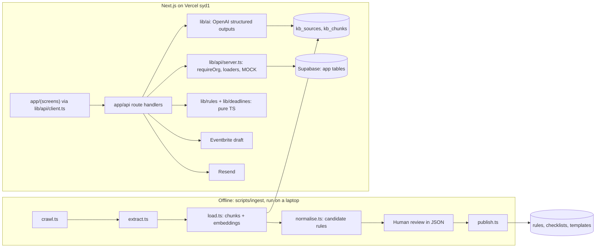

# EvntX TRD

26 Sep 2026 · Ashutosh Gauniyal · Describes the repo as built. The original TRD PDF is the source; differences are listed under "Changes from the original TRD".

## Overview and scope

EvntX runs on a pre-built council knowledge base. Council rules, checklists, templates, forms and fees are scraped ahead of time from the CCC site, reviewed by a human and stored in Supabase. At runtime the AI never browses the web, it reads only from our store, which makes the demo fast, repeatable and explainable.

| Council | Slug | Site | Demo role |
| --- | --- | --- | --- |
| Christchurch City Council | `ccc` | ccc.govt.nz | The only council (audit decision, 26 Sep 2026) |

**In scope:** ingestion pipeline, knowledge base, event profiling, rules engine, drafting, checklist checking, deadline engine, PDF export, reminders, Eventbrite draft, auth.
**Out of scope:** live scraping at runtime, real lodgement, payments, other councils.
**Runtime dependencies:** Supabase, OpenAI, Resend, Eventbrite. Each has a demo fallback.

## Architecture

| Layer | Choice | Why |
| --- | --- | --- |
| Frontend and API | Next.js 16 App Router, TypeScript, Tailwind v4, Vercel `syd1` | One repo, preview per PR, functions next to the Sydney database |
| Database, auth, storage | Supabase: Postgres, pgvector, Auth (`@supabase/ssr`), Storage | Relational rules plus vector search in one place |
| Scraper | Node scripts via `tsx`: fetch + Cheerio | Runs locally, never on Vercel. Add Playwright only if a seed page needs JS |
| Document parsing | pdf-parse v2, mammoth | Council forms are mostly PDF and Word |
| AI | openai v7 structured outputs with Zod 4 schemas, embeddings from `OPENAI_MODEL_EMBED` (1536 dimensions) | Event credits; the app always receives valid JSON |
| PDF export | @react-pdf/renderer (pdf-lib for official forms is P2) | Server-side |
| Email | Resend + Vercel Cron | Reminders |

### Request path (every API route)

1. `requireOrg()` reads the Supabase session cookie (`lib/supabase/server.ts`). No user: 401. First sign-in creates an organisation and membership. `MOCK=1`: returns `demo-org`.
2. `if (MOCK()) return ok(fixture.x)` in the exact real response shape.
3. `loadEvent(id, orgId)` / `loadDocument(id, orgId)` with the service-role client (`lib/supabase/admin.ts`), always filtered by org. Missing or not yours: 404.
4. Deterministic work (`lib/rules`, `lib/deadlines`) or AI work (`lib/ai`, wrapped in `withDemoFallback` for the seeded event).
5. `handler()` turns every thrown error into JSON `{ error }` with a status (400 validation, 401, 404, 409 wrong step, 500).

`proxy.ts` refreshes the session cookie on every request and redirects signed-out users from screens to `/login`. RLS is on for every table as defence in depth: knowledge tables have no policies (closed to the public API), app tables are per organisation.

## Changes from the original TRD

| Change | Why |
| --- | --- |
| Drafting is per document: `POST /api/documents/:id/draft`, replacing `POST /api/events/:id/documents` | The UI fires one request per document in parallel, so each card flips as it lands (progress for free, no streaming code), each call gets its own 60 s budget, one failure doesn't sink the rest |
| `POST /api/documents/:id/fix` applies the fix and re-checks | Red turns green in one click, one round trip |
| Draft, check and fix all return `EventDocument` | One shape for the Documents screen |
| Added `GET /api/events`, `GET /api/events/:id`, `GET /api/events/:id/documents`, `GET /api/licences` | Screens must rebuild after a refresh; dashboard needs lists |
| `/answers` returns `{ profile, questions }` like `/profile` | UI replaces state wholesale |
| Document status adds `manual` | Official form, site plan and food licence are not AI drafts. Eventbrite unlocks when every document is `ready` or `manual` |
| `Requirement.lastChecked`, `EventDocument.checklistSource` | F13: every requirement and checklist shows its source and last-checked date |
| Auth: service-role client plus explicit org filter, with RLS as backup | The kit took `orgId` from the request body and had no auth |
| Static CCC rules merge with published rules by id, per council | Publishing rules must not switch off the static CCC fallback |
| DEMO_MODE fallback only for the seeded event (same description, council ccc) | Never show the demo data for a judge's event |
| `nzToday()` for "today" in NZ; `nzLocalToUtc` fixed for the day DST changes | The demo is on the morning daylight saving starts |
| Vercel `regions: ["syd1"]`, Supabase in Sydney | Every DB round trip stays in Australia instead of crossing to Washington |
| Guest login (Supabase anonymous sign-in) next to email magic link | Judges can try it in one click; Supabase's built-in email is rate limited |
| CCC is the only council: no council picker, every event is `ccc`, second council removed (migration `0003_ccc_only.sql`) | Audit decision, 26 Sep 2026 |
| Reminder emails go only to `REMINDER_TO` | Safety: never email an address we have not configured |

## Knowledge ingestion (lane B)

Run once tonight, re-run only if a source changes.

1. **Seed.** Hand-picked URLs per council in `scripts/ingest/seeds.ts`. Not the whole site.
2. **Crawl** (`npm run ingest:crawl -- ccc`). Links up to depth 2, same domain, paths matching events, alcohol, licences, road closures, parks, fees, noise, food, forms. Obeys robots.txt, 1 request per second, user agent names EvntX and a contact email (the script refuses to run until the email is set). Raw files go to `data/raw/<council>/` (gitignored, never republished).
3. **Extract** (`ingest:extract`). HTML to markdown with headings (nav and footer stripped), PDF via pdf-parse, DOCX via mammoth.
4. **Load** (`ingest:load`). Raw files to Storage `kb/raw/<council>/<sha256>.<ext>`, chunks of about 800 tokens split by heading, embedded, into `kb_chunks` with the source URL.
5. **Normalise** (`ingest:normalise`). AI reads each source and writes candidate rules, checklists, templates, lead times and fees to `data/normalised/<council>/*.json`, every item quoting its source sentence. All start unverified.
6. **Review.** A human checks each item against the live page and adds `"verified": true` to the ones confirmed.
7. **Publish** (`ingest:publish`). Only verified items are upserted into `rules`, `checklists`, `templates` with `last_checked`.

CCC seeds (confirmed): event permits, conditions for events on public land, event resources (H&S template, food and special licence guidance), parks fees and charges, road closures for events, building consent exemption, smokefree events checklist (PDF), event permit application form.

CCC permit triggers (question 2 on the permits page): marquee over 100 sqm, stage over 1 m or large structures, bouncy castles or inflatables (high risk), mechanical rides, activities affecting roads or footpaths. Most applications need event details, a site plan, a health and safety management plan, waste management plan confirmation, possible fees and acceptance of the terms. These are hand-coded in `lib/rules/ccc.ts`.

CCC runs a District Licensing Committee: seed its alcohol licensing pages for special licence forms, fees, the 20 working day rule and host responsibility requirements.

## Data model

`supabase/migrations/0001_init.sql` is the source of truth.

**Knowledge tables** (written only by ingestion with the service role, RLS on, no policies):

| Table | Key columns | Notes |
| --- | --- | --- |
| councils | id, slug (`ccc`), name, timezone | Seeded by the migration |
| kb_sources | council_id, url, type, sha256, storage_path, fetched_at | Unique (council_id, url) |
| kb_chunks | source_id, heading, content, embedding vector(1536) | HNSW index; `match_kb_chunks(council_slug, query_embedding, match_count)` |
| rules | id (text), council_id, condition, outcome, source_url, source_quote, verified, last_checked | Merged with `lib/rules/ccc.ts` by id |
| checklists | council_id, document_type, items `[{id,text,sourceQuote}]`, source_url, verified, last_checked | Unique per council and type |
| templates | council_id, document_type, sections `["Event overview", …]`, source_url | Drafting structure |
| form_fields | council_id, form_name, field_key, label, profile_path | P2 |

**App tables** (RLS per organisation):

| Table | Key columns |
| --- | --- |
| organisations, memberships | Created on first sign-in by `requireOrg()` |
| events | org_id, council_id, description, profile (EventProfile), classification, status, eventbrite_event_id |
| requirements | event_id, rule_id, document_type, reason, source_url, last_checked |
| documents | event_id, document_type (unique per event), content (DraftDocument), check_results (CheckResult), status |
| deadlines | event_id, document_type (unique per event), label, legal_minimum, recommended, reminded_14_at, reminded_3_at |
| licences | org_id, type, holder_name, expires_on |

**Rule conditions** are small JSON expressions evaluated in TypeScript (`lib/rules/engine.ts`): `{"path":"alcohol.supply","eq":"sold"}`, `{"path":"structures.largestMarqueeSqm","gt":100}`, `{"path":"structures.inflatables","truthy":true}`, combined with `{"all":[…]}` / `{"any":[…]}`. Paths are EventProfile dot paths; `{value, source}` fields unwrap automatically.

**Document status:** `pending` (row created by /requirements, drafted type) → `drafted` (/draft) → `needs_fix` or `ready` (/check or /fix). `manual` is set at creation for types EvntX doesn't draft (`DRAFTED_TYPES` in `lib/schemas.ts`). Re-running /requirements keeps existing drafts and removes documents no longer required.

## AI pipeline (lane A)

Every AI call gets its context from our database, never the web, and uses structured outputs against a Zod schema in `lib/schemas.ts`. Prompts live only in `lib/ai/prompts.ts`.

| Step | Code | Input | Output | Model | Notes |
| --- | --- | --- | --- | --- | --- |
| 1 Profile | `buildProfile` | Description, council, NZ date | EventProfile | fast | Temperature 0. Unknowns to `missing` |
| 2 Follow-ups | `followUps` | Missing paths that a verified rule reads | Up to 3 FollowUpQuestion | none | Fixed question bank; answers merged by `applyAnswers`, no AI |
| 3 Classification | `classify` | Profile + top 5 chunks | Classification | strong | Shown as "likely" |
| 4 Requirements | `requiredDocuments` | Profile + verified rules | Requirement[] | none | Pure TS |
| 5 Drafting | `draftDocument` | Profile, template sections, checklist, top 5 chunks | DraftDocument | strong | One call per document, UI runs them in parallel |
| 6 Checking | `checkDocument` / `applyFix` | Draft + checklist | CheckResult / DraftDocument | fast | Fix re-checks in the same request |
| 7 Deadlines | `computeDeadlines` | Event date, requirements | Deadline[] | none | Working days, Canterbury holidays, liquor period |

Retrieval: embed a query from the document type, take the top 5 `kb_chunks` for that council, pass them fenced with their ids and URLs. The model must cite chunk ids for council-specific claims. Prompt rules: never invent names, dates, fees or phone numbers; only facts from the profile or sources; plain NZ English; unknowns as `[PLACEHOLDER]`. Model names come from `OPENAI_MODEL_FAST` / `OPENAI_MODEL_STRONG`, embeddings from `OPENAI_MODEL_EMBED` (must output 1536 dimensions to match `kb_chunks`). Reasoning models (o-series, gpt-5) automatically skip `temperature: 0`, which they reject.

## API contract

All routes are Next.js route handlers, authenticated by session (`requireOrg`), JSON in and out, mock-first. Types are in `lib/schemas.ts`; the browser calls them through `lib/api/client.ts`. AI routes set `maxDuration = 60`.

| Method and route | Body | Returns | Errors | Client |
| --- | --- | --- | --- | --- |
| GET /api/events | | EventSummary[] | | `api.listEvents()` |
| POST /api/events | `{ description, council? }` (10 to 2000 chars; council defaults to and must be `ccc`) | `{ id }` | 400 | `api.createEvent()` |
| GET /api/events/:id | | EventDetail | 404 | `api.getEvent()` |
| POST /api/events/:id/profile | | ProfileResponse `{ profile, questions }` | 404 | `api.buildProfile()` |
| POST /api/events/:id/answers | `{ answers: [{ path, answer }] }` | ProfileResponse | 400 unknown path or option, 409 no profile | `api.answer()` |
| POST /api/events/:id/classify | | Classification | 409 no profile | `api.classify()` |
| POST /api/events/:id/requirements | | Requirement[] (also creates document rows) | 409 no profile | `api.requirements()` |
| GET /api/events/:id/documents | | EventDocument[] | | `api.listDocuments()` |
| POST /api/documents/:id/draft | | EventDocument | 409 not drafted type, no template, no profile | `api.draft()` |
| POST /api/documents/:id/check | | EventDocument | 409 not drafted, no checklist | `api.check()` |
| POST /api/documents/:id/fix | `{ itemId }` | EventDocument (re-checked) | 409 no fix for item | `api.fix()` |
| GET /api/events/:id/deadlines | | Deadline[] (stored for the cron) | 409 no date | `api.deadlines()` |
| GET /api/events/:id/export | | application/pdf | | `api.exportUrl()` |
| POST /api/events/:id/eventbrite | `{ tickets? }` | EventbriteDraft `{ id, url }` | 409 until every document is ready or manual | `api.eventbrite()` |
| GET /api/licences | | Licence[] | | `api.licences()` |
| POST /api/demo/reminder | | `{ ok: true }` | 404 unless DEMO_MODE=1 | `api.demoReminder()` |
| GET /api/cron/reminders | header `Authorization: Bearer $CRON_SECRET` | `{ sent, today }` | 401 | Vercel Cron only |
| GET /auth/callback | `?code=` | redirect | | Magic link |

In MOCK mode the event id is `demo` and document ids come from the fixture's `documents` array. Exactly one document is `needs_fix` with a red checklist item; `/fix` on it returns `fixedDocument`, all green, so the mock flow can unlock Eventbrite.

## Integrations

| Integration | How | Demo fallback |
| --- | --- | --- |
| Eventbrite | Private token. POST `/organizations/{id}/events/` as a draft, then ticket classes. Start and end in UTC with timezone Pacific/Auckland, currency NZD, capacity from the profile. Stores the event id. Never publishes | `EVENTBRITE_DEMO_DRAFT_URL`, served if the call fails or takes over 20 s in DEMO_MODE |
| Resend | Reminder with event name, document, date and a link back. Daily cron (14 and 3 days before `recommended`) or the demo route | Screenshot of a received email |
| PDF export | Cover page, each drafted document, sources appendix, disclaimer on every page | Pre-generated PDF of the seeded event |
| Official forms (P2) | pdf-lib fills AcroForm fields via `form_fields` | Not in demo |

Dates use `Intl` with `Pacific/Auckland`, never hardcoded offsets. Daylight saving starts at 2am Sunday 27 Sep 2026, the morning of the demo.

## Security, privacy and scraping compliance

| Area | Requirement | Where |
| --- | --- | --- |
| Scraping etiquette | robots.txt, 1 req/s, user agent with contact email, seed list + depth 2, run once | `scripts/ingest/crawl.ts` |
| Terms and copyright | Read the CCC terms of use and copyright pages before crawling. Store sources for our own use, always link back, never republish council documents as our own | `data/` is gitignored |
| Secrets | Server env vars only, never in the client or the repo. Secrets scan before the repo goes public | `.env*` gitignored |
| Data access | Every query filtered by the caller's org; RLS on every table; knowledge tables closed to the public API | `lib/api/server.ts`, migration |
| Personal data | Only event and organisation details. Demo uses fake people | |
| Prompt injection | Scraped text passed as fenced reference data | `fence()` in `lib/ai/client.ts` |
| Liability | Every screen and export: EvntX prepares, the organiser reviews and lodges, not legal advice | Root layout, PDF |

## Testing and demo reliability

| Test | Covers | Owner | Status |
| --- | --- | --- | --- |
| `tests/rules.test.ts` | Every CCC trigger, the demo event's requirement list, answer merging, unverified rules never fire, council isolation | C / B | Passing |
| `tests/deadlines.test.ts` | Working days, weekends, Waitangi Day, 20 Dec to 15 Jan liquor period, NZ date | C | Passing |
| `tests/eventbrite.test.ts` | NZDT, NZST, the DST change day | C | Passing |
| `tests/contract.test.ts` | Every fixture piece parses against its schema; questions match the follow-up logic; one red item and its fix | A | Passing |
| Schema tests | Every live AI response parses, 10 runs of the seeded event | A | To do |
| Golden path end to end | Describe to export to Eventbrite draft on the deployed URL | D | To do |
| Device check | Live URL on a phone and a second laptop, logged out and in | Lead | To do |

Demo safety net: `DEMO_MODE=1` serves cached AI answers for the seeded event if a call takes over 20 s or fails. Deploy freeze 8am Sunday.

## Build plan to Sunday 10am

Four lanes, one contract. Everyone builds against `lib/schemas.ts` and the MOCK fixture from the first hour, so nobody waits on anyone. Clocks go forward at 2am, so there is one hour less overnight.

| When | A (AI, lead) | B (Knowledge) | C (Backend) | D (Frontend) |
| --- | --- | --- | --- | --- |
| Now to +45m | Review schemas and fixture with the team, then freeze | Seed URLs, robots and terms check, start CCC crawl | Repo, Supabase, Vercel with MOCK=1 (docs/SETUP.md) | Deploy check, layout shell, stepper |
| To 8pm | Profile and follow-ups live against CCC | Extract, chunk, embed CCC | Auth end to end, real events/profile/answers/requirements | Describe and Profile screens on MOCK |
| 8pm to midnight | Drafting with retrieval, checking, fix | Normalise and review CCC rules, checklists, templates, publish | Real documents/draft/check/fix, deadlines | Documents and checklist screen |
| Midnight to 4am | Classification, DEMO_MODE on every AI route | CCC source re-check | PDF export, Eventbrite draft, reminders | Site plan, deadlines, dashboard |
| 4am to 8am | Schema tests, prompt tuning on the seeded event | Check every source and fee shown on screen | Unit tests, secrets scan, seed demo org | End to end on live URL, phone check, polish |
| 8am to 10am | Rehearse pitch twice, submit | Demo operator backup | Deploy freeze at 8am, watch logs | Demo driver |

### Handoffs

| From | To | What | Interface | By |
| --- | --- | --- | --- | --- |
| A | Everyone | Frozen contract | `lib/schemas.ts`, `fixtures/demo-event.json` | +45m |
| C | D | Live preview URL, MOCK on | Vercel URL in channel | +45m |
| C | A, B | Supabase keys, migration run | `.env.local` values, privately | +45m |
| B | A | CCC chunks searchable | `match_kb_chunks('ccc', …)` returns sensible rows | 8pm |
| A | C | Profile and follow-ups live | `buildProfile`, `followUps`, `applyAnswers` | 8pm |
| B | A, C | Verified CCC templates and checklists | `templates`, `checklists` rows (verified) | midnight |
| B | C | Verified CCC rules | `rules` rows, npm test still green | midnight |
| A | C | Draft, check, fix live | `draftDocument`, `checkDocument`, `applyFix` | midnight |
| C | D | Real routes behind the same shapes | MOCK=0 on the preview | 2am |

### Check-ins

Ten minutes at 8pm, midnight, 4am and 8am: done, blocked, need from whom. Anything blocked for more than 30 minutes is raised straight away, not at the next check-in.

## Definition of done for the demo

- [ ] The demo event runs from description to Eventbrite draft on the live URL with real AI calls
- [ ] Every rule, fee and deadline on screen has a verified source and last-checked date
- [ ] DEMO_MODE fallback tested with the network throttled
- [ ] Repo public or `justus-lumin` invited, no secrets in history
- [ ] Live URL works on a phone and a second laptop, logged out and in

## Open technical questions

- [ ] robots.txt and terms of use on ccc.govt.nz before crawling (B)
- [ ] Does the CCC event permit form (tfaforms) expose field names, or map by label? (B, P2)
- [ ] Are CCC special licence fees council-set or the national default bands? (B)
- [ ] Host responsibility requirement wording and alcohol management plan threshold, with sources (B)
- [ ] Which OpenAI models the event credits cover, and rate limits (A)
- [ ] Eventbrite account and organisation id for the demo draft (C)
- [ ] Canterbury holiday dates verified against employment.govt.nz (C)
